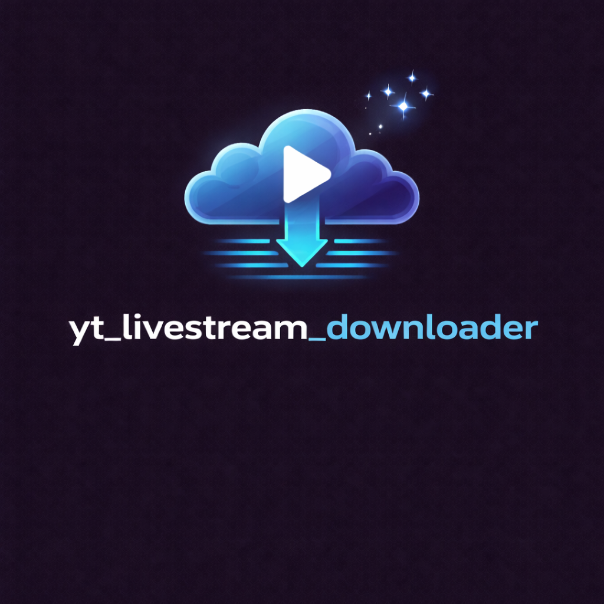

<!-- codex-branding:start -->
<p align="center"></p>

<p align="center">
  
  
  
</p>
<!-- codex-branding:end -->

# YT Livestream Downloader


> A desktop GUI tool that records YouTube livestreams in timed segments, saving each chunk as a separate file. Built with PyQt6 and powered by yt-dlp + ffmpeg.


## Quick Start

```bash
git clone https://github.com/YOUR_USERNAME/yt-livestream-downloader.git
cd yt-livestream-downloader
python yt_livestream_downloader.py
```

PyQt6 and yt-dlp are auto-installed on first run. The only external dependency you need pre-installed is **ffmpeg**.

## Features

| Feature | Description |
|---------|-------------|
| **Segmented Recording** | Records livestreams in configurable time chunks (1-360 min, default 30 min) |
| **Quality Selection** | Best, 1080p, 720p, 480p, or Audio Only |
| **Auto-Retry** | Configurable retry attempts per segment with automatic reconnection on network drops |
| **Scheduled Start** | Set a future date/time to automatically begin recording |
| **Stream Info Preview** | Fetch and display stream title + live status before recording |
| **Live Stats Dashboard** | Real-time segment count, total size, elapsed time, and status cards |
| **Toast Notifications** | In-app notification when each segment completes |
| **Segment Playback** | Double-click any recorded segment to open in your default media player |
| **Persistent Settings** | Remembers output folder, quality, segment length, retries, and last URL between sessions |
| **Dependency Validation** | Startup check for yt-dlp and ffmpeg with version display |
| **Crash Logging** | Writes `crash.log` on unhandled exceptions for debugging |
| **Dark Theme** | Catppuccin Mocha dark interface |

## Prerequisites

| Requirement | Notes |
|-------------|-------|
| **Python 3.8+** | [python.org](https://www.python.org/downloads/) |
| **ffmpeg** | Must be on your system PATH |
| **yt-dlp** | Auto-installed via pip if missing |
| **PyQt6** | Auto-installed via pip if missing |

### Installing ffmpeg

**Windows:** Download from [gyan.dev/ffmpeg/builds](https://www.gyan.dev/ffmpeg/builds/) (get the `essentials` build), extract, and add the `bin` folder to your system PATH.

**macOS:**
```bash
brew install ffmpeg
```

**Linux (Debian/Ubuntu):**
```bash
sudo apt install ffmpeg
```

### JavaScript Runtime (Recommended)

Recent versions of yt-dlp recommend a JavaScript runtime for YouTube extraction. Install **deno** for best results:

**Windows:**
```powershell
irm https://deno.land/install.ps1 | iex
```

**macOS/Linux:**
```bash
curl -fsSL https://deno.land/install.sh | sh
```

Without a JS runtime, yt-dlp may display a warning and some formats could be unavailable.

## Usage

1. **Launch** the app: `python yt_livestream_downloader.py`
2. **Paste** a YouTube livestream URL
3. **(Optional)** Click **Fetch Info** to verify the stream is live
4. **Configure** segment length, quality, and output folder as needed
5. Click **Start Recording** — segments save automatically as `StreamTitle_seg001_TIMESTAMP.mp4`
6. Click **Stop** at any time — the current partial segment is saved
7. **Double-click** any segment in the list to play it

### Scheduled Recording

Check **Scheduled Start**, set a date/time, and click Start. The app will wait with a countdown timer and begin recording automatically when the time arrives.

### Output Files

Files are saved to `~/Downloads/YT_Livestreams` by default. Each segment is a standalone `.mp4` (or `.m4a` for audio-only) file named:

```
Stream_Title_seg001_20260208_230333.mp4
Stream_Title_seg002_20260208_233333.mp4
Stream_Title_seg003_20260209_000333.mp4
```

## How It Works

```
┌─────────────────┐     ┌─────────────────┐     ┌─────────────────┐
│   YouTube URL    │────>│     yt-dlp      │────>│  ffmpeg -t Ns   │
│                  │     │                 │     │                 │
│  Paste stream    │     │  Resolves live  │     │  Records for N  │
│  URL into GUI    │     │  stream formats │     │  seconds, saves │
│                  │     │  & passes to    │     │  as .mp4 file   │
│                  │     │  ffmpeg         │     │                 │
└─────────────────┘     └─────────────────┘     └────────┬────────┘
                                                         │
                                              Segment complete?
                                                         │
                                                    ┌────▼────┐
                                                    │  Loop:  │
                                                    │  Start  │
                                                    │  next   │
                                                    │ segment │
                                                    └─────────┘
```

Each segment launches a fresh yt-dlp process with `--downloader ffmpeg` and `--downloader-args "ffmpeg:-t <seconds>"`. When ffmpeg's time limit is reached, the process exits, the file is saved, and the next segment begins immediately from the live edge. There is a brief gap (2-5 seconds) between segments while the new process initializes.

Auto-retry handles transient network failures. After 3 consecutive segment failures, the app assumes the stream has ended and stops.

## Configuration

Settings are persisted to:

| OS | Location |
|----|----------|
| Windows | `%APPDATA%\YTLivestreamDL\config.json` |
| macOS/Linux | `~/YTLivestreamDL/config.json` |

Saved fields: output directory, segment length, quality preset, retry count, last URL.

## Troubleshooting

| Issue | Solution |
|-------|----------|
| `ffmpeg: NOT FOUND` in header | Install ffmpeg and add to PATH. Restart the app. |
| `yt-dlp: NOT FOUND` in header | Run `pip install yt-dlp` or let the app auto-install on next launch. |
| `Requested format is not available` | Change quality from a specific resolution to "Best" — livestreams have limited format options. |
| JS runtime warning | Install deno (see Prerequisites). Not strictly required but recommended. |
| Segments are empty / 0 bytes | The stream may have ended, or the URL is not a live stream. Use **Fetch Info** to check. |
| Gaps between segments | Expected (2-5s). Each segment is an independent download from the live edge. |
| App freezes on close | The app waits up to 5 seconds for the current download to terminate. If it persists, force-close. |

## License

MIT License - see [LICENSE](LICENSE) for details.

## Contributing

Issues and PRs welcome. If you find a bug or have a feature request, please open an issue.
